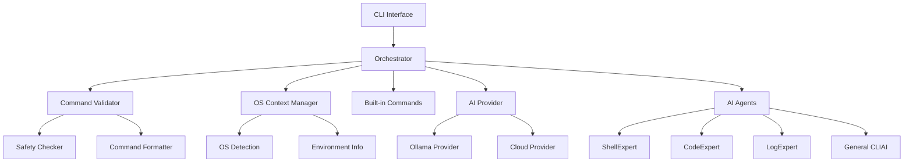

# Design Document

## Overview

This design transforms CLIAI from a prototype into a production-ready CLI tool by implementing comprehensive reliability improvements and professional features. The architecture maintains the existing multi-agent pipeline while adding critical safety layers, OS awareness, and provider abstraction. The design prioritizes safety-by-default behavior, command validation, and seamless user experience while supporting both local (free) and cloud (Pro) AI backends.

## Architecture

### High-Level Architecture



### Core Design Principles

1. **Safety First**: All commands are validated and formatted before execution
2. **OS Awareness**: System-specific behavior based on detected operating system
3. **Provider Abstraction**: Clean separation between local and cloud AI backends
4. **Fail-Safe Defaults**: Auto-execution disabled by default, comprehensive warnings
5. **Incremental Enhancement**: Preserve existing functionality while adding reliability layers

## Components and Interfaces

### 1. Command Validator

The Command Validator is a new component that sits between the AI agents and command execution, ensuring all generated commands are safe, properly formatted, and executable.

```rust
pub trait CommandValidator {
    fn validate(&self, command: &str) -> ValidationResult;
    fn rewrite_common_mistakes(&self, command: &str) -> String;
    fn check_quoting(&self, command: &str) -> QuotingResult;
    fn detect_hallucinated_flags(&self, command: &str) -> Vec<String>;
}

pub struct DefaultCommandValidator {
    dangerous_patterns: Vec<Regex>,
    common_rewrites: HashMap<String, String>,
    hallucinated_flags: Vec<String>, // Known bad flags like --hidden, --recursivee
    os_context: OSContext,
}

pub enum ValidationResult {
    Valid(String),
    Invalid(String, Vec<ValidationError>),
    Sensitive(String, Vec<SecurityWarning>),
}

pub enum ValidationError {
    HallucinatedFlag(String),
    PlaceholderDetected(String),
    SyntaxError(String),
    QuotingIssue(String),
}
```

**Key Features:**
- Rule-based detection of common hallucinated flags (e.g., `ls --hidden`, `grep --recursivee`)
- Automatic rewriting of common mistakes (e.g., `ls --hidden` → `ls -a`)
- Token-aware safety checking that ignores quoted strings
- OS-specific command validation
- Placeholder detection and rejection

### 2. OS Context Manager

Provides operating system awareness throughout the application, enabling OS-specific command generation and path handling.

```rust
pub struct OSContext {
    pub os_type: OSType,
    pub package_manager: PackageManager,
    pub shell: Shell,
    pub paths: SystemPaths,
}

pub enum OSType {
    ArchLinux,
    Ubuntu,
    Debian,
    // Non-Linux support is best-effort in v1.0
    MacOS,      // Limited support
    Windows,    // Limited support
    Unknown,
}

pub enum PackageManager {
    Pacman,     // Arch Linux
    Apt,        // Ubuntu/Debian
    // Limited support for others in v1.0
    Yum,        // Best-effort
    Brew,       // Best-effort
    Unknown,
}

impl OSContext {
    pub fn detect() -> Self;
    pub fn get_install_command(&self, package: &str) -> String;
    pub fn get_system_info_command(&self) -> String;
    pub fn get_config_path(&self) -> PathBuf;
}
```

**Detection Strategy:**
- Read `/etc/os-release` on Linux systems
- Use `uname -a` for additional system information
- Check for distribution-specific files (`/etc/arch-release`, `/etc/debian_version`)
- Cache results for performance

### 3. AI Provider Abstraction

Clean abstraction layer supporting multiple AI backends with consistent interfaces.

```rust
pub trait AIProvider: Send + Sync {
    async fn generate_response(&self, prompt: &str, agent: &AgentProfile) -> Result<String>;
    async fn list_models(&self) -> Result<Vec<String>>;
    fn get_provider_type(&self) -> ProviderType;
    fn is_available(&self) -> bool;
}

pub enum ProviderType {
    Local,
    Cloud,
}

pub struct OllamaProvider {
    client: reqwest::Client,
    base_url: String,
    model: String,
}

pub struct CloudProvider {
    client: reqwest::Client,
    api_key: String,
    endpoint: String,
    model: String,
}

pub struct ProviderManager {
    providers: Vec<Box<dyn AIProvider>>,
    fallback_chain: Vec<ProviderType>,
    retry_limits: HashMap<ProviderType, u32>,
    circuit_breaker: CircuitBreaker,
}

impl ProviderManager {
    pub async fn get_response(&self, prompt: &str) -> Result<String> {
        for provider_type in &self.fallback_chain {
            let retry_limit = self.retry_limits.get(provider_type).unwrap_or(&1);
            
            for attempt in 0..*retry_limit {
                if let Some(provider) = self.get_provider(provider_type) {
                    match provider.generate_response(prompt).await {
                        Ok(response) => return Ok(response),
                        Err(e) if attempt < retry_limit - 1 => {
                            // Retry with backoff
                            tokio::time::sleep(Duration::from_millis(100 * (attempt + 1))).await;
                            continue;
                        }
                        Err(e) => {
                            // Cloud provider failures trigger immediate fallback after 1 retry
                            if matches!(provider_type, ProviderType::Cloud) {
                                break;
                            }
                        }
                    }
                }
            }
        }
        Err(anyhow!("All providers failed"))
    }
}
```

**Provider Selection Logic:**
1. Check user subscription status
2. If Pro: attempt cloud provider first
3. If cloud fails or not available: fall back to local
4. If local fails: return appropriate error message

### 4. Copy-Paste Safe Output System

Ensures command output is immediately usable in terminals without manual cleanup.

```rust
pub struct CommandOutput {
    pub command: Option<String>,
    pub explanation: String,
    pub warnings: Vec<String>,
}

impl CommandOutput {
    pub fn format_for_display(&self) -> String {
        let mut output = String::new();
        
        // Strict format: Command first, explanation separate
        if let Some(cmd) = &self.command {
            output.push_str(&format!("Command: {}\n", cmd));
        }
        
        if !self.explanation.is_empty() {
            output.push_str(&format!("\nExplanation: {}\n", self.explanation));
        }
        
        // Never mix command and explanation text
        output
    }
}
```

**Critical Rule:** Commands and explanations must never be mixed in output to prevent accidental pasting of explanatory text.

### 5. Built-in Command System

Hardcoded mappings for common commands to provide instant responses without AI processing.

```rust
pub struct BuiltinCommands {
    commands: HashMap<String, BuiltinCommand>,
}

pub struct BuiltinCommand {
    pub pattern: Regex,
    pub command_template: String,
    pub description: String,
    pub requires_confirmation: bool,
}

impl BuiltinCommands {
    pub fn new() -> Self {
        let mut commands = HashMap::new();
        
        // File operations - exact matches only for safety
        commands.insert("list_files".to_string(), BuiltinCommand {
            pattern: Regex::new(r"^(ls|list files?)$").unwrap(),
            command_template: "ls -la".to_string(),
            description: "List all files including hidden ones".to_string(),
            requires_confirmation: false,
        });
        
        // Add 19 more essential commands with strict patterns...
        commands
    }
    
    pub fn match_command(&self, input: &str) -> Option<&BuiltinCommand> {
        // Only match simple, unambiguous requests
        let trimmed = input.trim().to_lowercase();
        if trimmed.len() > 20 {
            return None; // Too complex for built-in
        }
        
        for command in self.commands.values() {
            if command.pattern.is_match(&trimmed) {
                return Some(command);
            }
        }
        None
    }
}
```

**Essential Built-in Commands:**
1. `ls -la` - List files including hidden
2. `pwd` - Show current directory
3. `whoami` - Show current user
4. `hostname` - Show system hostname
5. `uname -a` - Show system information
6. `df -h` - Show disk usage
7. `free -h` - Show memory usage
8. `ps aux` - List processes
9. `git status` - Git repository status
10. `find . -name "*.ext"` - Find files by extension
11. `mkdir dirname` - Create directory
12. `touch filename` - Create empty file
13. `cat filename` - Display file contents
14. `wc -l filename` - Count lines in file
15. `grep pattern filename` - Search in file
16. `cp source dest` - Copy files
17. `mv source dest` - Move/rename files
18. `chmod +x filename` - Make file executable
19. `which command` - Find command location
20. `test -f filename && echo 'exists' || echo 'not found'` - Check file existence

### 6. Enhanced Safety System

Comprehensive safety checking with expanded sensitive command detection.

```rust
pub struct SafetyChecker {
    sensitive_patterns: Vec<SensitivePattern>,
    fork_bomb_patterns: Vec<Regex>,
    pipe_to_shell_patterns: Vec<Regex>,
    shell_parser: ShellParser, // For token-aware parsing
}

pub struct SensitivePattern {
    pub pattern: Regex,
    pub severity: SeverityLevel,
    pub description: String,
    pub suggestion: Option<String>,
}

pub enum SeverityLevel {
    Warning,    // Show warning but allow execution
    Dangerous,  // Require explicit confirmation
    Blocked,    // Never allow execution
}

impl SafetyChecker {
    pub fn check_command(&self, command: &str) -> SafetyResult {
        // Parse command into tokens to avoid false positives
        let tokens = self.shell_parser.parse(command)?;
        
        // Check actual command tokens, ignore quoted strings
        for token in tokens.iter().filter(|t| !t.is_quoted()) {
            // Check for fork bombs: :(){ :|:& };:
            // Check for pipe-to-shell: curl | sh, wget | bash
            // Check for destructive operations: rm -rf, chmod 777
            // Check for system modifications: dd, mkfs, fdisk
        }
    }
}
```

### 7. Configuration System Enhancement

Extended configuration with new safety and provider options.

```rust
#[derive(Serialize, Deserialize, Clone)]
pub struct Config {
    // Existing fields
    pub model: String,
    pub ollama_url: String,
    pub prefix: Option<String>,
    
    // New reliability fields
    pub auto_execute: bool,
    pub dry_run: bool,
    pub safety_level: SafetyLevel,
    pub context_timeout: u64,
    pub provider_preference: ProviderType,
    
    // Pro features
    pub api_key: Option<String>,
    pub subscription_status: SubscriptionStatus,
}

#[derive(Serialize, Deserialize, Clone)]
pub enum SubscriptionStatus {
    Free,
    Pro { expires_at: DateTime<Utc> },
}
```

## Data Models

### Command Processing Pipeline

```rust
pub struct CommandRequest {
    pub user_input: String,
    pub context: ProcessingContext,
}

pub struct ProcessingContext {
    pub os_context: OSContext,
    pub working_directory: PathBuf,
    pub environment: HashMap<String, String>,
    pub conversation_history: Vec<ChatTurn>,
}

pub struct CommandResponse {
    pub command: Option<String>,
    pub explanation: String,
    pub safety_warnings: Vec<SafetyWarning>,
    pub execution_mode: ExecutionMode,
}

pub enum ExecutionMode {
    SuggestOnly,    // Default: show command, never execute
    Safe,           // Can execute without confirmation
    RequiresConfirmation(Vec<String>), // Needs user confirmation
    DryRunOnly,     // Show only, never execute (dry-run mode)
    Blocked(String), // Cannot execute, show reason
}
```

### Agent Communication

```rust
pub struct AgentRequest {
    pub prompt: String,
    pub context: AgentContext,
    pub constraints: AgentConstraints,
}

pub struct AgentContext {
    pub os_info: OSContext,
    pub recent_history: Vec<ChatTurn>,
    pub working_directory: String,
    pub available_commands: Vec<String>,
}

pub struct AgentConstraints {
    pub max_response_length: usize,
    pub require_command_format: bool,
    pub safety_level: SafetyLevel,
}
```

Now I need to use the prework tool to analyze the acceptance criteria before writing the correctness properties section.

<function_calls>
<invoke name="prework">
<parameter name="featureName">cliai-reliability-improvements

## Correctness Properties

*A property is a characteristic or behavior that should hold true across all valid executions of a system—essentially, a formal statement about what the system should do. Properties serve as the bridge between human-readable specifications and machine-verifiable correctness guarantees.*

### Property 1: Command Format Validation
*For any* ShellExpert response, the output should either start with "Command: " followed by a valid command line, or "Command: (none)" for non-executable requests, and the system should never attempt to execute "(none)"
**Validates: Requirements 1.1, 1.4, 1.5**

### Property 2: Format Enforcement and Retry
*For any* malformed ShellExpert response without proper "Command: " prefix, the system should reject it and request a properly formatted response
**Validates: Requirements 1.2**

### Property 3: Command Combination Logic
*For any* user request requiring multiple operations, the system should combine them using shell operators (&&, ||, |) in a single command line rather than separate commands
**Validates: Requirements 1.3**

### Property 4: Safe Default Configuration
*For any* fresh CLIAI installation, the configuration should have auto_execute set to false and commands should be displayed without execution
**Validates: Requirements 2.1, 2.2**

### Property 5: Auto-execution Behavior
*For any* configuration state, when auto_execute is false, commands should be displayed with manual execution instructions, and when true, sensitive commands should still require confirmation
**Validates: Requirements 2.3, 2.5**

### Property 6: Configuration Modification
*For any* valid configuration change request, the system should provide the ability to modify auto_execute and other settings through configuration commands
**Validates: Requirements 2.4**

### Property 7: Command Validation
*For any* generated command, the validator should check for hallucinated flags, placeholder text, and common mistakes, automatically rewriting correctable issues
**Validates: Requirements 3.1, 3.2, 3.3, 3.4**

### Property 8: OS Detection and Context
*For any* system startup, the OS should be correctly detected and stored in OS_Context, and this context should be included in all AI agent prompts
**Validates: Requirements 4.1, 4.5**

### Property 9: OS-Aware Command Generation
*For any* command generation request, the system should use OS-appropriate package managers, paths, and installation commands based on the detected operating system
**Validates: Requirements 4.2, 4.3, 4.4**

### Property 10: Built-in Command System
*For any* user request matching one of the 20 essential command patterns, the system should return the mapped command immediately without AI processing while still respecting auto_execute configuration
**Validates: Requirements 5.1, 5.2, 5.5**

### Property 11: Built-in Command Logging
*For any* built-in command usage, the system should log the activity but skip AI agent calls, and the built-in commands should cover file operations, directory operations, and system information
**Validates: Requirements 5.3, 5.4**

### Property 12: File Existence Checking Consistency
*For any* file or directory existence request, the system should use the standard test patterns ("test -f" for files, "test -d" for directories) with proper quoting for paths containing spaces
**Validates: Requirements 6.1, 6.2, 6.4**

### Property 13: File Existence Method Flexibility
*For any* file existence check, the system should prefer the standard test pattern but allow equivalent safe methods like stat when appropriate
**Validates: Requirements 6.3**

### Property 14: Multiple File Existence Handling
*For any* request to check multiple files, the system should provide separate test commands for each file rather than attempting to combine them
**Validates: Requirements 6.5**

### Property 15: Safe Context Gathering
*For any* context gathering operation, only whitelisted read-only commands should be executed, with configurable timeout, and failures should not prevent system operation
**Validates: Requirements 7.1, 7.2, 7.3, 7.4**

### Property 16: Context Integration
*For any* successful context gathering, the information should be included in AI prompts to improve response accuracy
**Validates: Requirements 7.5**

### Property 17: Fork Bomb Detection
*For any* command containing fork bomb patterns like ":(){ :|:& };:", the system should detect and warn users about the dangerous nature
**Validates: Requirements 8.1**

### Property 18: Pipe-to-Shell Detection
*For any* command containing pipe-to-shell patterns like "curl | sh" or "wget | bash", the system should classify them as sensitive and require confirmation
**Validates: Requirements 8.2**

### Property 19: Dangerous Operation Detection
*For any* command containing disk write operations (dd, mkfs, fdisk) or other dangerous patterns (chmod 777, chown -R, recursive deletions), the system should require explicit confirmation with clear warnings
**Validates: Requirements 8.3, 8.4, 8.5**

### Property 20: Context Window Management
*For any* AI agent call, ShellExpert should receive the last 3 conversation turns plus working directory context, while General agents should receive full conversation history
**Validates: Requirements 9.1, 9.2**

### Property 21: History Truncation
*For any* conversation exceeding 10 turns, the system should automatically truncate older entries while prioritizing recent interactions and including relevant system information
**Validates: Requirements 9.3, 9.4, 9.5**

### Property 22: Test Suite Validation
*For any* test execution, the system should validate generated commands against expected patterns using regex, detect hallucinated flags, execute safe commands, and provide detailed failure analysis
**Validates: Requirements 10.1, 10.2, 10.3, 10.4, 10.5**

### Property 23: Authentication Flow
*For any* "cliai login" command, the system should open a browser-based authentication flow and store secure tokens upon successful authentication
**Validates: Requirements 11.1, 11.2**

### Property 24: Provider Selection
*For any* user with Pro subscription, the system should use hosted cloud models instead of local Ollama, with clear subscription status indication
**Validates: Requirements 11.3, 11.4**

### Property 25: Privacy-Preserving Usage Tracking
*For any* Pro mode usage, the system should track only aggregate API usage metrics for billing without storing command content or user data
**Validates: Requirements 11.5**

### Property 26: Offline Functionality
*For any* system operation, core command generation should work completely offline using local Ollama models, with graceful fallback when cloud services are unavailable
**Validates: Requirements 12.1, 12.2, 12.4**

### Property 27: Mode Switching Preservation
*For any* switch between Local and Pro modes, user configuration and history should be preserved, with automatic fallback to Local mode when Pro is unavailable
**Validates: Requirements 12.3, 12.5**

### Property 28: Interface Simplicity
*For any* user interaction, the system should maintain the simple `cliai <natural language task>` interface without requiring quotes or subcommands, with consistent behavior across terminal environments
**Validates: Requirements 13.1, 13.4**

### Property 29: Error Handling Quality
*For any* error condition, the system should provide clear, actionable error messages with suggested solutions and immediate feedback for configuration changes
**Validates: Requirements 13.2, 13.5**

### Property 30: Arch Linux Native Support
*For any* operation on Arch Linux, the system should use pacman for package management, Arch-specific paths and conventions, correct package names, and provide AUR installation instructions
**Validates: Requirements 14.1, 14.2, 14.3, 14.4, 14.5**

### Property 31: Configuration Management
*For any* configuration operation, the system should store config in standard location, recreate corrupted config with safe defaults, provide management commands, apply changes immediately, and validate settings
**Validates: Requirements 15.1, 15.2, 15.3, 15.4, 15.5**

### Property 32: Copy-Paste Safe Output
*For any* command output, the system should provide clean command text without markdown formatting, separate explanations from commands clearly, and format multiple commands appropriately
**Validates: Requirements 16.1, 16.2, 16.3, 16.4, 16.5**

### Property 33: Dry-Run Mode
*For any* dry-run operation, the system should show commands without executing them, display "DRY RUN:" prefix, perform all validation steps, and allow toggling through configuration
**Validates: Requirements 17.1, 17.2, 17.3, 17.4, 17.5**

### Property 34: Intent Classification
*For any* user request, the system should distinguish between explanatory questions and actionable requests, avoiding destructive commands for explanations and asking for clarification when intent is unclear
**Validates: Requirements 18.1, 18.2, 18.4**

### Property 35: Destructive Command Handling
*For any* explicitly requested destructive action, the system should provide clear warnings about consequences and require explicit confirmation of intent
**Validates: Requirements 18.3, 18.5**

### Property 36: Quoting and Escaping Correctness
*For any* command with file paths containing spaces or special characters, the system should properly quote paths, use appropriate escaping, avoid ambiguous globbing, and ensure proper variable quoting to prevent injection
**Validates: Requirements 19.1, 19.2, 19.3, 19.4, 19.5**

### Property 37: Provider Abstraction
*For any* AI provider implementation, the system should use a common trait interface, allow adding new providers without Orchestrator changes, support runtime switching, and provide graceful fallback
**Validates: Requirements 20.1, 20.2, 20.3, 20.4**

### Property 38: Provider Interface Completeness
*For any* provider implementation, the interface should abstract model selection, request formatting, and response parsing completely
**Validates: Requirements 20.5**

## Error Handling

### Error Categories

1. **Configuration Errors**
   - Invalid configuration files → Recreate with safe defaults
   - Missing configuration → Create default configuration
   - Invalid settings → Reject with helpful error messages

2. **AI Provider Errors**
   - Ollama unavailable → Clear error message with setup instructions
   - Cloud provider failure → Automatic fallback to local provider
   - Model not found → List available models and suggest alternatives

3. **Command Validation Errors**
   - Placeholder detection → Request specific command from AI
   - Unknown flags → Suggest correct alternatives
   - Dangerous commands → Display warnings and require confirmation

4. **System Errors**
   - OS detection failure → Use generic Unix defaults
   - Context gathering timeout → Continue without failed context
   - File system errors → Graceful degradation with user notification

### Error Recovery Strategies

```rust
pub enum ErrorRecoveryStrategy {
    Retry { max_attempts: u32, backoff: Duration },
    Fallback { alternative: Box<dyn Fn() -> Result<T>> },
    GracefulDegradation { reduced_functionality: bool },
    UserIntervention { prompt: String, suggestions: Vec<String> },
}
```

### Logging and Diagnostics

- All errors logged to `~/.config/cliai/error.log`
- **Privacy-first logging**: Commands and prompts are redacted by default
- Structured logging with context information
- Debug mode for detailed troubleshooting (with explicit user consent)
- User-friendly error messages with actionable suggestions

**Log Privacy Rules:**
- User input is never logged unless debug mode is explicitly enabled
- Commands are never logged in production mode
- Only system errors, performance metrics, and configuration changes are logged
- Debug logs require explicit user consent and are clearly marked

## Testing Strategy

### Dual Testing Approach

The testing strategy employs both unit tests and property-based tests to ensure comprehensive coverage:

**Unit Tests:**
- Specific examples and edge cases
- Integration points between components
- Error conditions and boundary cases
- Configuration management scenarios
- Authentication flow testing

**Property-Based Tests:**
- Universal properties across all inputs
- Command validation with randomized inputs
- OS detection across different system configurations
- Provider switching and fallback scenarios
- Safety checking with various dangerous command patterns

### Property-Based Testing Configuration

- **Framework**: Use `proptest` crate for Rust property-based testing
- **Iterations**: Minimum 100 iterations per property test
- **Test Tagging**: Each property test references its design document property
- **Tag Format**: `// Feature: cliai-reliability-improvements, Property {number}: {property_text}`

### Test Categories

1. **Command Format Tests**
   - Property tests for format validation across random inputs
   - Unit tests for specific format edge cases
   - Malformed response handling tests

2. **Safety and Validation Tests**
   - Property tests with dangerous command pattern generators
   - Unit tests for specific known dangerous commands
   - Placeholder detection with various patterns

3. **OS Awareness Tests**
   - Property tests across different OS contexts
   - Unit tests for specific OS detection scenarios
   - Package manager selection validation

4. **Provider Abstraction Tests**
   - Property tests for provider switching scenarios
   - Unit tests for specific provider implementations
   - Fallback behavior validation

5. **Integration Tests**
   - End-to-end workflow testing
   - Authentication flow testing
   - Configuration management testing

### Test Data Generation

```rust
// Example property test structure
#[cfg(test)]
mod tests {
    use proptest::prelude::*;
    
    proptest! {
        // Feature: cliai-reliability-improvements, Property 1: Command Format Validation
        #[test]
        fn test_command_format_validation(
            user_input in ".*",
            os_context in any::<OSContext>()
        ) {
            let response = generate_shell_response(&user_input, &os_context);
            prop_assert!(
                response.starts_with("Command: ") || 
                response.starts_with("Command: (none)")
            );
        }
    }
}
```

### Continuous Integration

- All tests run on multiple OS environments (Linux, macOS, Windows)
- Property tests run with extended iteration counts in CI
- Performance regression testing for response times
- Security scanning for dependency vulnerabilities